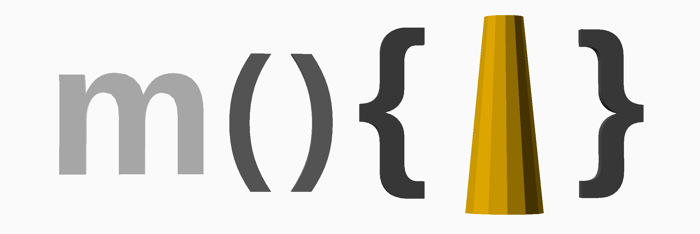

# Mocad Library

## Introduction

This is the **Mocad Library** (hereafter just **Mocad**), a set of functions, modules and part libraries based on the brilliant **OpenSCAD**.

With **Mocad** and OpenSCAD, in a few lines of code, you can build complex mechanical devices.


In **Mocad**, Parts can be made in a variety of different styles, but what they share in common is that they also describe various positions of interest.


These **Positions** can be manipulated, to connect parts together and to perform other calculations.

## Audience

People who might be interested in **Mocad** are people who like OpenSCAD - the idea of using code to create CAD projects, and who additionally would like to use some of the libraries and helper functions Mocad has to offer.

Anyone who currently is working with mechanisms of any kind and who thinks perhaps doing CAD should be more like writing code might find this library intriguing.

People who are not coders, or who do not want to learn to code, probably won't like this library.  At all.

## Installation and Getting Started

A prequisite to using **Mocad** is the installation of OpenSCAD.  OpenSCAD is available for free for Mac, Windows and Linux platforms, and can be found here:

[OpenSCAD Downloads](http://www.openscad.org/downloads.html)

With OpenSCAD installed, one can either download this repository's zip, or clone just clone it.

OpenSCAD will function on relatively modest machines, however, to load large arrays of files - such as some of the Mocad Part Library index files, higher end machines may be required.  One hint should always be born in mind - text labels are quite complex graphically.  A scene that won't function at all on a particular machine may work just fine with text turned off.

To do this, set ```moText = false``` in ```mo/mo.scad```

Once the OpenSCAD is installed and Mocad is sitting somewhere there are several possible
next steps.

- open one of the index files (```index.scad``` - very large or ```mocad\moIndex.scad```)
to see what parts are available
- open an example (from the ```example\``` directory) to see how Mocad can be used and abused
- open any part file - part writers are encouraged to make files invoke an instance 
of their parts upon direct opening.
- open the tutorial document containing all the tutorial code (again, this is a big
  file)

As you gain confidence with OpenSCAD and Mocad, start thinking about your own projects. Can your project be modeled in the OpenSCAD Mocad combination?  Do you need extra parts? Would others appreciate them?

## User Guide

There is a short user guide outlining the various features and giving some flavor of **Mocad** here:

[User Guide](doc/userguide.md)

## Reference

Reference documentation, including Mocad functions and modules part design, directory layout, etc. is here:

[Reference](doc/reference.md)

## Tutorial

There is also a tutorial - a very quick overview of OpenSCAD followed by a lengthy run through of the basic principles of Mocad.

[Tutorial](tutorial/tutorial.md)

All code discussed in the tutorial is available as a single OpenSCAD file

[Tutorial OpenSCAD Code](tutorial/moTutorial.scad)

## Versions

This code is not yet versioned.  Consider it alpha quality.  At the appropriate time, it will get released as a 1.0 and a corresponding branch created.

## Testing

This code has been developed on Mac and Linux.  No formal testing mechanisms are present.  

An excellent test for the integrity of the various internal modules and functions is to open the tutorial code.  

[Tutorial OpenSCAD Code](tutorial/moTutorial.scad)

If all seems well in there, it is likely things are OK with the codebase.

## Status

Mocad is alpha code.  It is being developed for use in several small projects, so
will likely improve over time.

Issues and feedback are encouraged.  Does this make sense?  Are there critical gaps
in the documentation?

Pull Requests are welcome, although adherence to file and part conventions outlined
in the Reference is requested.

## Related Resources

### OpenSCAD
- [Home](http://www.openscad.org)
- [Downloads](http://www.openscad.org/downloads.html)
- [Documentation](http://www.openscad.org/documentation.html)
- [MakerBlock's Tutorials](http://www.makerbot.com/tutorials/openscad-tutorials)

### OpenSCAD Parts
- [Thingiverse Parts](http://www.thingiverse.com/openscad/collections/libraries)
- [Shapeways Parts](http://www.shapeways.com/search?q=openscad)

### Actobotics
- [Servo City](https://www.servocity.com/html/actoboticstm.html)
- [SparkFun](https://www.sparkfun.com/actobotics)

## Acknowledgements

The team that creates OpenSCAD are the major enablers of this project.  The environment keeps getting better and better.

There are other "Connector" libraries, although Mocad was developed independently.  The ultimate structure of the **Mocad** **Position** was decided by consulting Obiscad:

[Obiscad attach.scad](https://github.com/Obijuan/obiscad/blob/master/obiscad/attach.scad)

Maths.scad (despite the irregular spelling!) offers numerous helpful math routines.  *Mocad* uses some of these in the *Position* manipulation code.
