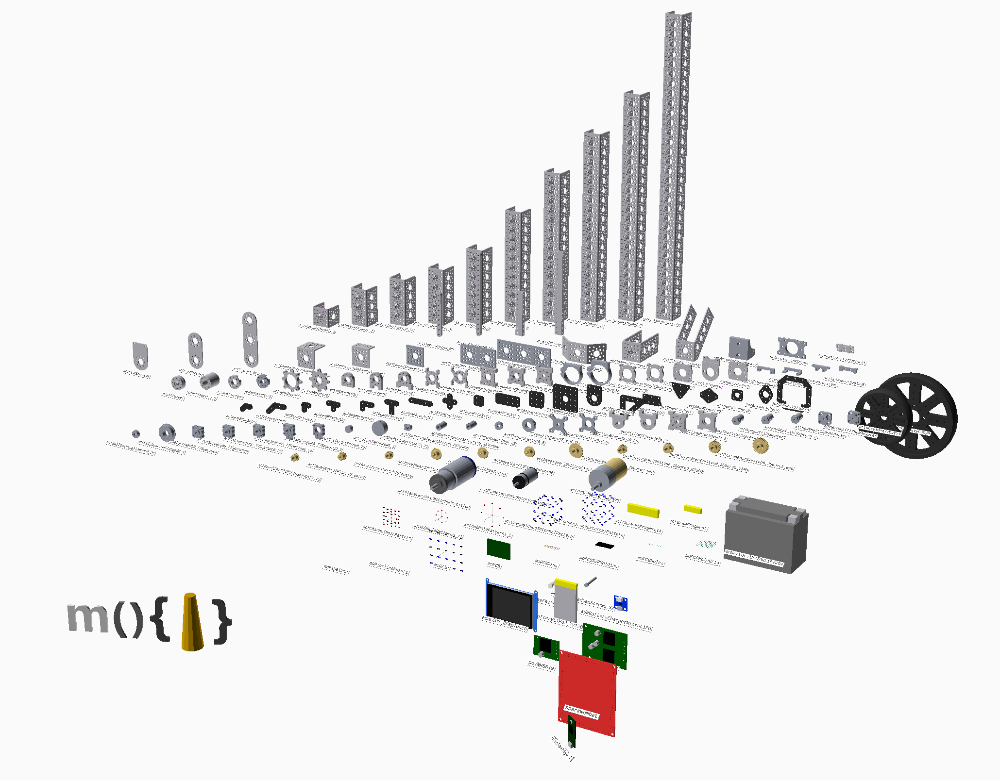
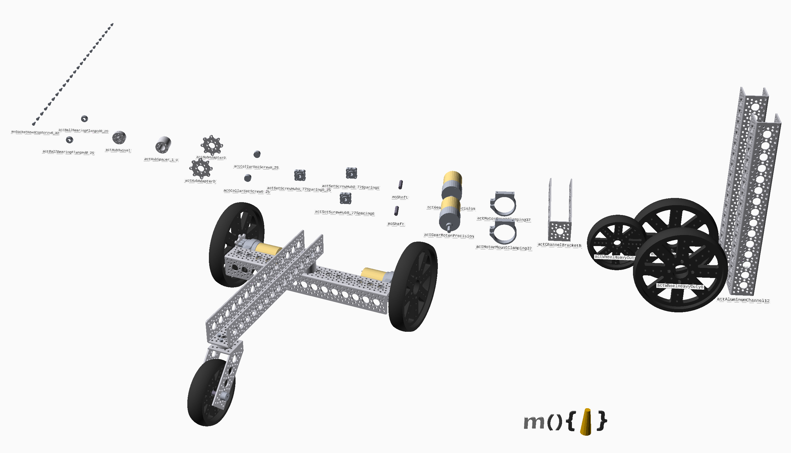
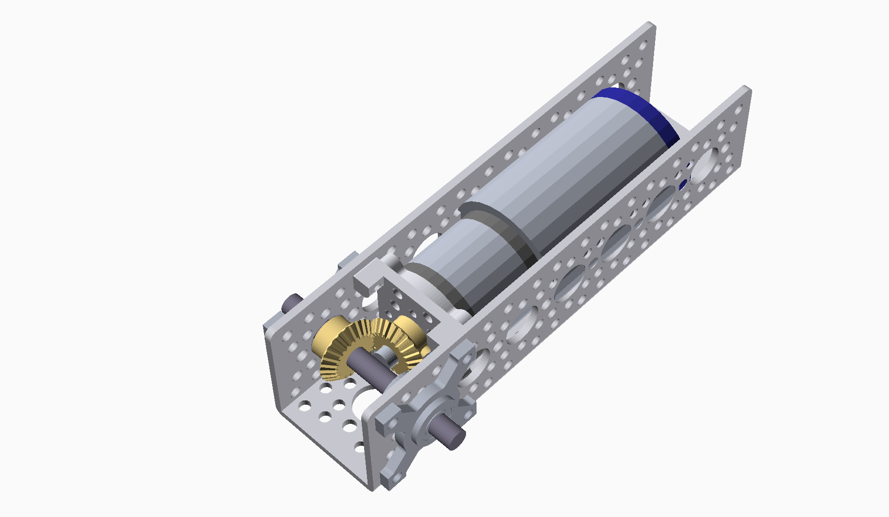
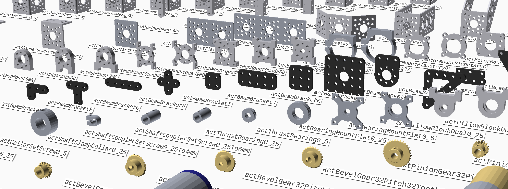
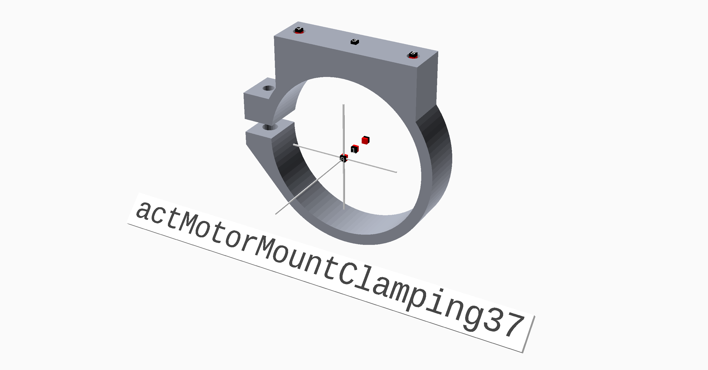
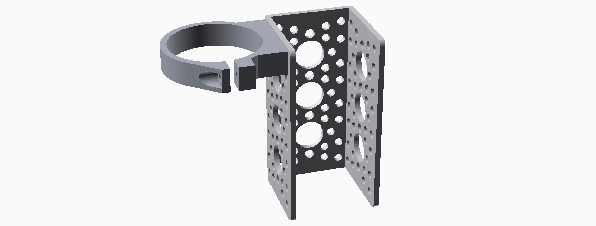
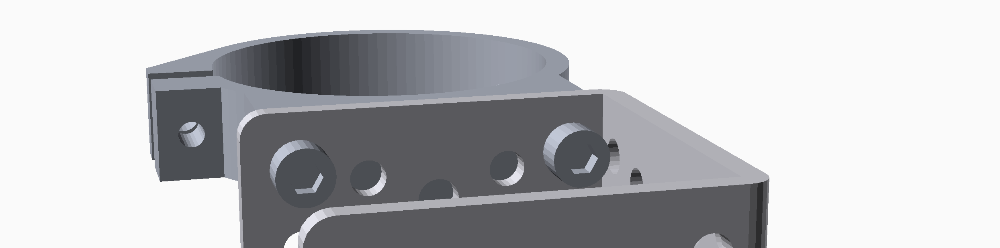
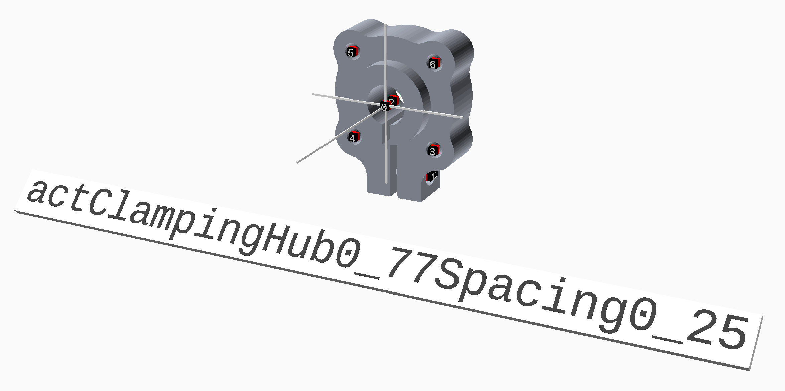

# MOCAD LIBRARY OVERVIEW

## OpenSCAD and the Mocad Library

The idea of OpenSCAD is to open the arena of CAD up to software.  To a software engineer, or anyone familar with
writing code this will seem like a very natural idea.  To others who are not so comfortable with coding, this
may seem like a complete nightmare!  The potential is to bring to 3D design the same
kind of reuse, versioning and productivity we see in the software area.

There are a few programmatical CAD packages.  OpenSCAD was one of the first, and there have been
several subsequent ones.  One cast iron advantage of OpenSCAD over the others (especially the web-based ones)
is its speed.  It is *much* faster.

### What is Mocad?

The Mocad Library (hereafter, just "Mocad") is a set of conventions, a little code and some premade parts that
makes it easier to write re-usable OpenCAD objects.

Mocad is new but it does have the beginning of a library of parts to play with.  Here's the Mocadopolis shot - showing all parts from all libraries:



The majority of the parts available are from the great range of robot contruction parts called **Actobotics** from Servo City (https://www.servocity.com/).  Roughly 80% of the Actobotics parts are encapsulated in Mocad code.  What made this feasible was that Actobotics parts are almost all available in CAD form - easily convertible into STL which can then be loaded into OpenSCAD.

## Mocad Uses

Using the parts already present many interesting things can be built, for example, here is one of Servo City robot kits, presented with its constituent components:



Mocad can be used to put projects together before buying parts to make sure things are going to work out.  Here is one example of a bevel gear mechanism:



It took several different attempts to find one close to optimal in space consumption, robustness, etc.

Another great benefit of this representation concerns overlap.  The large Actobotics Heavy Duty Planetary Gearmotors don't quite fit in their standard 1.5" channel.  But what exactly is the degree of overlap?  With one additional functional line (calling ```intersection( )```), that becomes completely obvious:


This process also highlights a couple of places where the models for the channel and
channel mounting bracket overlap by a hair, although this is more of a modelling issue
than a design issue for the mechanism.

Mocad can also help in other domains.  Here is a layout of a project using Adafruit's great 2.8" TFT LCD screen, and PRJC's outstanding Teensy 3.1 together on a SparkFun Wombat board with some other parts.  The objective of this ongoing project is to help design a close-fitting enclosure.


## Mocad Operation

Mocad promotes part reuse by pairing the definition of parts with **Positions**.  This is similar to the concept of **Connector** expressed in other libraries, in fact Mocad **Positions** are exactly compatible with mechanisms used in many of these other libraries.

The way to use Mocad is to load a part then decide which Positions are important and start connecting!

First, you can find parts by loading one of the part indexes.  Each part libray has a visual index which shows parts and their names. Here is a closeup of the Actobotics library.



Find your part and note the name.  In your code, just add the line to pull the part in:

```
use <../actobotics/actMotorMountClamping37.scad>
```

Then just make one of them, passing in parameters to turn the position information on.  Here we also request the part name.

```
actMotorMountClamping37( info = true, $name = true  );
```

You'll then be able to see and play with the part, noting in particular where the positions are that you might want to use.



Let's connect this part up to something else.  We'll load in one of the smaller channels, and take a look.


At first glance, our channel looks like it has caught some horrible disease,
however upon closer inspection those dots are all positions.  Just by looking at the
part you can see what is what.

So, let's connect the clamp.



The clamp connects perfectly with the channel.  Looking close up at the other side of
the channel we can see that the holels are lined up perfectly.


How did we do that?  Here's the complete code.

```
use <../actobotics/actAluminumChannel3_0.scad>
use <../actobotics/actMotorMountClamping37.scad>

include <../mo/mo.scad>

// Create the channel at the origin
actAluminumChannel3_0( );

// Attach the flipped child part (the clamp) by the specified position on the clamp,
// to the specified position on the channel which is at the origin.
moAttach( 0,                                               // origin
          actAluminumChannel3_0Position( [ 2, 2, 0 ] ),    // position on channel
          moFlipPosition,                                  // flip the part
          actMotorMountClamping37Position( 3 ) )           // position on the clamp
  actMotorMountClamping37(  );
```  
So in a few short lines, and with zero prior knowledge of the parts, we can be building things.

We can easily add the screws that would secure these together with another few lines:

```
use <../mocad/moSocketHeadCapScrew6_32.scad>
```
```
moAttach( 0, actAluminumChannel3_0Position( [ 2, 5, 22 ] ) )
  moSocketHeadCapScrew6_32( );

moAttach( 0, actAluminumChannel3_0Position( [ 2, 5, 26 ] ) )
  moSocketHeadCapScrew6_32( );
```



To illustrate further, here's a small part of the Actobotics 3 Wheel Robot Kit depicted above.  It connects the wheel to the motor, then the motor to the clamp:


And here is the complete Mocad module that generates it:

```
// define a module that can make a LHS or RHS motor assembly
module act3WheelDriveMotor( left = true ) {

  // The assembly is going to be built around the motor clamp

  // First we look up the the location of the third position on the motor clamp
  // which is where we're going set the part origin
  clampMountPosition = actMotorMountClamping37Position( 3 );
  clampPosition = moAttachPosition( 0, 0, 0, clampMountPosition );

  // Move the clamp to the part origin
  moMoveTo( clampPosition )
    actMotorMountClamping37( );

  // We're also going to want the position that gives us the center of the mount
  // This position will depend on the handedness of the unit
  clampCenter = actMotorMountClamping37Position( ( left ) ? 2 : 1 );

  // For the motor position, offset the clamp a little (in a direction that depends on the handedness)
  motorClampJoint = moLinearPosition( ( left ) ? -0.3 * in : -0.5 * in );
  // Calculate the position of the motor, based on the clamp, the clamp center, and the motor position
  motorPosition = moAttachPosition( clampPosition, clampCenter, motorClampJoint );
  // Calculate where the shaft is in relation to the motor
  motorShaftPosition = actGearMotorPrecisionPosition( 3 );

  // Move the motor the calculated position
  moMoveTo( motorPosition )
    actGearMotorPrecision(  );

  // To mount the hub on the motor, we're going to need to flip it
  hubToMotorJoint = moFlipPosition;
  // Work out where the other side of the hub will be
  hubOtherSidePosition = actSetScrewHub0_77Spacing6Position( 1 );
  // Work out where to attach the hub to the motor
  hubPosition = moAttachPosition( motorPosition, motorShaftPosition, hubToMotorJoint );

  // Move the hub into position
  moMoveTo( hubPosition )
    actSetScrewHub0_77Spacing6();

  // Work out where the hub adapter is going and move it there
  hubAdapterPosition = moAttachPosition( hubPosition, hubOtherSidePosition, moFlipPosition );
  hubAdapterOtherSidePosition = actHubAdapterDPosition( [1,0] );
  moMoveTo( hubAdapterPosition )
    actHubAdapterD( );

  // Work out the attach point for the wheel, and place it
  wheelPosition = moAttachPosition( hubAdapterPosition, hubAdapterOtherSidePosition, moFlipPosition );
  moMoveTo( wheelPosition )
    actWheelHeavyDuty6();
}
```

As an extra bonus, a couple of extra lines gives us a nice cut away feature so
we can make sure everything is working OK inside:

```
// Subtract subsequent objects from the first
difference() {
  // first object
  act3WheelDriveMotor( left = true );
  // subtract this
  color( Red )
    cube( [ 200, 200, 200 ] );
}
```


While we're showing code: here's the code for the intersection of the Actobotics motor and 1.5" channel example above:

Regular drawing code:
```
// place the gearbox
actBevelGearboxC( 0, outputShaftLength = 2.5 * in, inputShaftLength = 0 );
// place the channel
moMoveTo( actBevelGearboxCPosition( [ 5, 0 ] ) )
  actAluminumChannel6_0();
````
Now becomes intersection code:
````
// take the intersection of all the following
intersection()
{
  // Intersect the gearbox
  actBevelGearboxC( 0, outputShaftLength = 2.5 * in, inputShaftLength = 0 );
  // With the correctly placed channel
  moMoveTo( actBevelGearboxCPosition( [ 5, 0 ] ) )
    actAluminumChannel6_0();
}
```


## Parts are key

For the Library to be useful, most of the mounting points and other points of interest
must be represented in the parts.  To a great extend, this is true.  This can be tedious work, but the
hope is that once done, the parts may be reused again and again.  Here are some more
examples.



