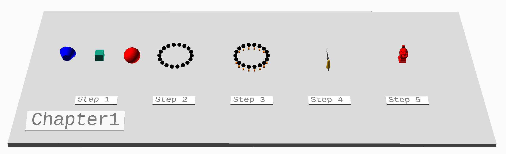
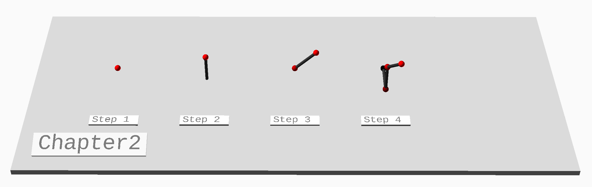
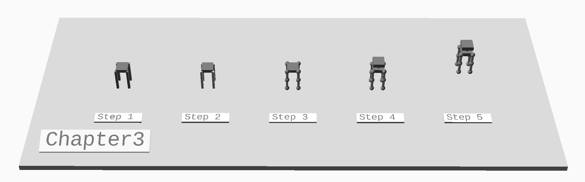
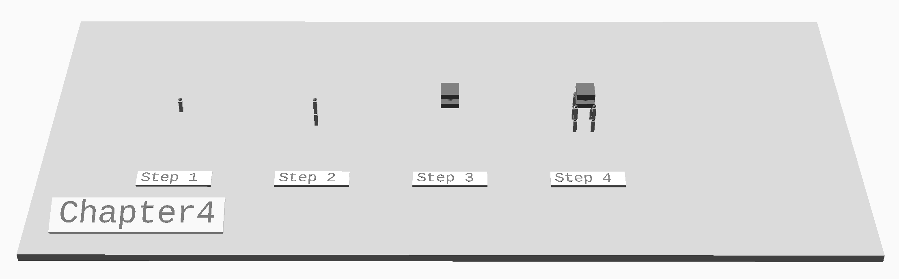
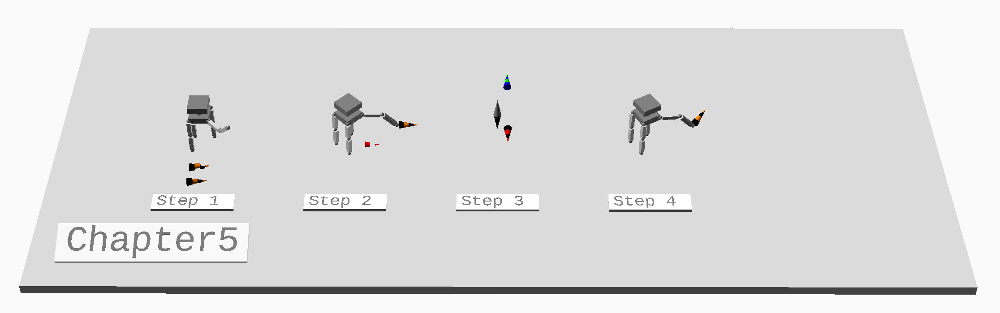
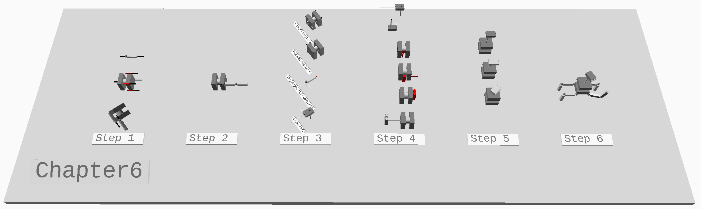
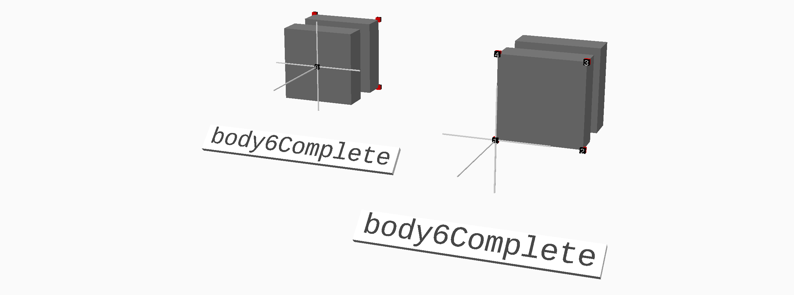
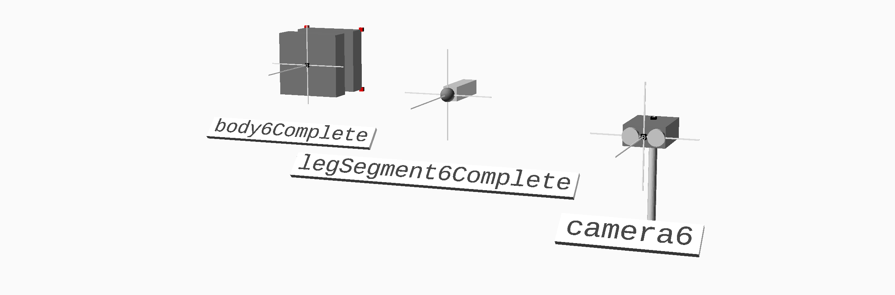
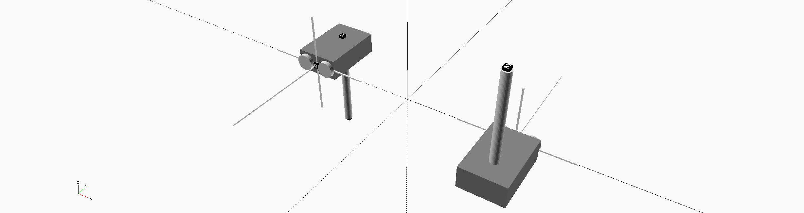

# MOCAD LIBRARY TUTORIAL

## Chapter 1 - Introduction to OpenSCAD



### Step 1

In what follows, we'll take a quick tour of selected parts of OpenSCAD, then more deeply into Mocad's internals.  If you're an OpenSCAD expert you might want to skip to Chapter 5 which is where the meat of the Mocad Library is introduced.

The OpenSCAD documentation is excellent - here's their handy cheat sheet.  http://www.openscad.org/cheatsheet/index.html  You might want to consult it from time to time.

Let's start by creating some geometry!  A cube is a good place to start.  Here the cube dimensions are specified in an array - ```[ xSize, ySize, zSize ]```.  The other parameter requests that rather than locating the cube with one corner at the origin, the cube should be centered.

```
cube( [ 16, 16, 16 ], center = true );  
```


The default color of the object depends on the Color Scheme selected.

There are many modifiers that can be added before the graphics primitives to change their location, color etc. For example, ```translate( )``` moves the whole stack beneath the specified distance (again, as ```[x, y, z]```).

```
translate( [ 0, 64, 0 ] )
  color( [ 1, 0, 0 ] )
    sphere( r = 16, center = true );
```


The module ```rotate( )``` rotates the whole thing by the angles specified ```[ xaxis, yaxis, zaxis ]```.

```
translate( [ 0, -64, 0 ] )
  rotate( [ 0, 90, 0 ] )
    color( [ 0, 0, 1.0 ] )
        cylinder( h = 16, r2 = 8, r1 = 16, center = true );
```


### Step 2

There are often times when, just as in regular coding, we want to encapsulate functionality
so we can save retyping things over and over and just get the details out of our faces.

Here we define a module called ```Shape``` which creates and colors a sphere.

```
module Shape( ) {
  color( [ 0, 0, 0 ] )
    sphere( r = 4, center = true );
}
```

Here we can use that shape, just as any other primitive function.  In this case we
invoke Shape inside a for loop.

```
r = 32;
for ( i = [ 0 : 20 : 360 ] )
  translate( [ r * sin( i ), r * cos( i ), 0 ] )
    Shape( );
```


### Step 3

Modules may also perform operations on graphics created beneath them.  Just is just
the same as ```translate( )```, for example, which operates on its children graphics.

Here we define a module called ```Encircle``` which does exactly what the ```for``` loop above
does, except does it in a modular way to any graphics defined beneath it

```
module Encircle() {
  r = 32;
  for ( i = [ 0 : 20 : 360 ] )
  translate( [ r * sin( i ), r * cos( i ) ], 0 )
    children( );
}
```
Now we can use it, simply by invoking it with some graphical children.

```
Encircle( ){
  Shape();
  translate( [ 0, 0, -10 ] )
  color( [ 1, 0.5, 0 ] )
    cube( [3,3,3], center=true );
}
```


### Step 4

By including the appropriate file, pre-built parts can be brought into your designs.

```
use<../mocad/moLogo.scad>

moLogo();
```


### Step 5

Sometimes the basic geometry for a part is already available in STL form.

STL geometry can be imported using the import statement.  Here, for example,
we import the robot from Make Magazine's 3D printer test suite.

```
color( Red )
  import("../mocad/stl/MAKE_Robot_V6.stl");
```


### Step 6

Debugging is required in OpenSCAD just as in any coding environment.  

The equivalent of printf( ) is ```echo( )```, which takes values as its comma separated arguments.

Of greater help, are the graphical debugging tools:

- ! preceding graphics commands will hide all other graphics.  Great for isolating something you're working on.
- \# makes the graphics beneath transparent
- \* stops the graphics beneath from rendering.

## Chapter 2 - Building in Steps



In order to get the feel of how more complex things are built, we consider a series of incremental
constructions.

### Step 1

First we define some colors and some shapes.

```
Red = [ 1, 0, 0 ];
Orange = [ 1, 0.5, 0 ];
Green = [ 0, 1, 0 ];
Blue = [ 0, 0, 1 ];
Charcoal = [ 0.2, 0.2, 0.2 ];

module Ball( d = 10, c = Red ) {
  color( c )
    sphere( d = d, center = true );
}

module Stick( l = 50, d = 5, c = Charcoal  ) {
  color( c )
    cylinder( h = l, d = d, center = true );
}
```

When we place something, it appears at the origin.  This we have seen before.

```
Ball();
```


### Step 2

To build structures, we place graphics, then offset those graphics and make more.

Here we create a ```Ball```, then move it off a little (half the stick height) to make room for the next thing -
in this case, a ```Stick```

```
Stick();
translate( [ 0, 0, 25 ] )
  Ball();
```


### Step 3

This process of move-place-move-place can go quite far.  Each operation transforms everything beneath it.

```
rotate( [ -45, 0, 0 ] ) {
  Ball( c = 0.75 * Red );
  translate( [ 0, 0, 25 ] ) {
    Stick();
    translate( [ 0, 0, 25 ] )
      Ball();
  }
}
```


### Step 4

And we can end up with quite elaborate structures.  Where things end up can get pretty confusing after a
while, so this is not necessarily the way we want to write this code!

```
Ball( c = 0 * Red );
translate( [ 25, 0, 0 ] ) {
  rotate( [ 0, 90, 0 ] )
    Stick();
  translate( [ 25, 0, 0 ] ) {
    rotate( [ 0, 0, -60 ] ) {
      Ball( c = 0.5 * Red );
      translate( [ 0, 0, 25 ] ) {
        Stick();
        translate( [ 0, 0, 25 ] ) {
          rotate( [ -45, 0, 0 ] ) {
            Ball( c = 0.75 * Red );
            translate( [ 0, 0, 25 ] ) {
              Stick();
              translate( [ 0, 0, 25 ] )
                Ball();
            }
          }
        }
      }
    }
  }
}
```


## Chapter 3 - Building More Complex Objects - Top Down



### Step 1

So how would we best go about making complex structures?  Just as in conventional coding,
we can do things Top Down or Bottom up.

First some more colors!

```
LightGray = [ 0.85, 0.85, 0.85 ];
Gray = [ 0.5, 0.5, 0.5 ];
```

Here we rough out the kind of object we're trying to make, using primitives with
no detail.

```
bodyW = 20;
bodyD = 6;
legL = 40;
legW = 4;

bodyW_2 = bodyW / 2;
legL_2 = legL / 2;

color( Gray ) {
  cube( [ bodyW, bodyW, bodyD ], center = true );
  translate( [ bodyW_2, -bodyW_2, -legL_2  ] )
    cube( [ legW, legW, legL ], center = true );
  translate( [ -bodyW_2, -bodyW_2, -legL_2  ] )
    cube( [ legW, legW, legL ], center = true );
  translate( [ -bodyW_2, bodyW_2, -legL_2  ] )
    cube( [ legW, legW, legL ], center = true );
  translate( [ bodyW_2, bodyW_2, -legL_2  ] )
    cube( [ legW, legW, legL ], center = true );
}
```


### Step 2

Happy with how the main object is looking, we can then start to draw out and refine
various features.

For example, from the above, we might want to define a leg.

```
module leg3_1( loc ) {
  legL = 40;
  legW = 4;
  legL_2 = legL / 2;
  translate( [ loc[ 0 ], loc[ 1 ], loc[ 2 ] - legL_2 ] )
    color( LightGray )
      cube( [ legW, legW, legL  ], center = true );
}
```

Then we replace the sketch legs above with invocations of the new, modular one.

```
bodyW = 20;
bodyD = 6;
bodyW_2 = bodyW / 2;

color( Gray )
  cube( [ bodyW, bodyW, bodyD ], center = true );
leg3_1( [  bodyW_2, -bodyW_2, 0 ] );
leg3_1( [ -bodyW_2, -bodyW_2, 0 ] );
leg3_1( [ -bodyW_2,  bodyW_2, 0 ] );
leg3_1( [  bodyW_2,  bodyW_2, 0 ] );
```


### Step 3

Now with the leg abstracted, we can refine it in one place and enjoy the benefits
everywhere the leg is used.

```
module leg3_3( loc ) {
  legL = 40;
  legW = 4;
  legL_2 = legL / 2;
  translate( loc ) {
    color( Gray )
      sphere( r=legW, center = true );
      translate( [ 0, 0, -legL_2/2 ] ) {
        color( LightGray )
          cube( [ legW, legW, legL/2  ], center = true );
        translate( [ 0, 0, -legL_2/2 ] ) {
          color( Gray )
            sphere( r=legW, center = true );
          translate( [ 0, 0, -legL_2/2 ] ) {
            color( LightGray )
              cube( [ legW, legW, legL/2  ], center = true );
            translate( [ 0, 0, -legL_2 / 2 ] )
              color( Gray )
                sphere( r=legW, center = true );
          }
        }
      }
    }
}
```

Now we use the new legs.

```
color( Gray )
  cube( [ bodyW, bodyW, bodyD ], center = true );
leg3_3( [  bodyW_2, -bodyW_2, 0 ] );
leg3_3( [ -bodyW_2, -bodyW_2, 0 ] );
leg3_3( [ -bodyW_2,  bodyW_2, 0 ] );
leg3_3( [  bodyW_2,  bodyW_2, 0 ] );
```


### Step 4

We can do the same with the body.

```
module body3_4( loc = [ 0, 0, 0 ] ) {
  bodyW = 20;
  bodyW_2 = bodyW / 2;
  bodyD = 6;
  bodyH = 20;
  translate( loc ) {
    color( Gray )
    cube( [ bodyW, bodyW, bodyH / 3], center = true );

    translate( [ 0, 0, bodyH / 3] ) {
    color ( LightGray )
    cylinder( h = bodyH / 3, d = bodyW_2, center = true );
    }

    translate( [ 0, 0, 2 * bodyH / 3 ] ) {
      color( Gray )
      cube( [ bodyW, bodyW, bodyH / 3 ], center = true );
    }
  }

}

```
And use it along with the new legs.

```
bodyW = 20;
bodyW_2 = bodyW / 2;

body3_4( );
leg3_2( [  bodyW_2, -bodyW_2, 0 ] );
leg3_2( [ -bodyW_2, -bodyW_2, 0 ] );
leg3_2( [ -bodyW_2,  bodyW_2, 0 ] );
leg3_2( [  bodyW_2,  bodyW_2, 0 ] );
```


## Chapter 4 - Bottom-Up Design



Sometimes, we want to build things from the bottom up, focusing on the details first,
before the big picture.

### Step 1

Let's say we want to develop the leg first.

```
legSegmentLength = 20;
legSegmentWidth = 4;

color( Gray )
  sphere( d=legSegmentWidth, center = true );
  translate( [ 0, 0, -legSegmentLength/2 ] ) {
    color( LightGray )
      cube( [ legSegmentWidth, legSegmentWidth, legSegmentLength - legSegmentWidth  ],
            center = true );
  }
```


### Step 2

Happy with the leg segment, we can then create an object with it

```
module legSegment4( ) {
  color( Gray )
    sphere( d=legSegmentWidth, center = true );
    translate( [ 0, 0, -legSegmentLength/2 ] ) {
      color( LightGray )
        cube( [ legSegmentWidth, legSegmentWidth, legSegmentLength - legSegmentWidth ],
              center = true );
    }
}
```

And now we can combine leg segments into a full leg.

```
legSegment4();
translate( [ 0, 0, -legSegmentLength ] )
  legSegment4();
```


### Step 3

We can do the same with the body.  Exploring how we want it to look.

```
bodyW = 20;
bodyW_2 = bodyW / 2;
bodyD = 6;
bodyH = 20;
color( Gray )
cube( [ bodyW, bodyW, bodyH / 3], center = true );

translate( [ 0, 0, bodyH / 3] ) {
color ( LightGray )
cylinder( h = bodyH / 3, d = bodyW_2, center = true );
}

translate( [ 0, 0, 2 * bodyH / 3 ] ) {
  color( Gray )
  cube( [ bodyW, bodyW, bodyH / 3 ], center = true );
}
```


### Step 4

Turning the leg and body into modules...

```
module leg4(  ) {
  legSegment4();
  translate( [ 0, 0, -legSegmentLength ] )
    legSegment4();
}

module body4( loc = [ 0, 0, 0 ] ) {
  bodyW = 20;
  bodyW_2 = bodyW / 2;
  bodyD = 6;
  bodyH = 20;
  translate( loc ) {
    color( Gray )
    cube( [ bodyW, bodyW, bodyH / 3], center = true );

    translate( [ 0, 0, bodyH / 3] ) {
    color ( LightGray )
    cylinder( h = bodyH / 3, d = bodyW_2, center = true );
    }

    translate( [ 0, 0, 2 * bodyH / 3 ] ) {
      color( Gray )
      cube( [ bodyW, bodyW, bodyH / 3 ], center = true );
    }
  }
}
```

We can build the full robot.

```
bodyW = 20;
bodyW_2 = bodyW / 2;

body4(  );
translate( [  bodyW_2, -bodyW_2, 0 ] )
  leg4( );
translate( [  -bodyW_2, -bodyW_2, 0 ] )
  leg4( );
translate( [  -bodyW_2, bodyW_2, 0 ] )
  leg4( );
translate( [  bodyW_2, bodyW_2, 0 ] )
  leg4( );

```


## Chapter 5 - Positions



### Step 1

Let's rebuild the robot from the last chapter.  We'll have leg segments.

```
legSegmentLength = 20;
legSegmentWidth = 4;

module legSegment5( ) {
  color( Gray )
    sphere( d=legSegmentWidth, center = true );
    translate( [ 0, 0, -legSegmentLength / 2 ] ) {
      color( LightGray )
        cube( [ legSegmentWidth, legSegmentWidth, legSegmentLength - legSegmentWidth ],
              center = true );
    }
}
```

And legs which are adjustable leg segments and which terminate in orientable actuators.
We add parameters to the leg function that govern all the limb angles.

```
module leg5( hipRotate = 0, legRotate = 0, kneeRotate = 0, actuatorPitch = 0, actuatorYaw = 0 ) {
  rotate( [ legRotate, 0, hipRotate ] ) {
    legSegment5( );
      translate( [ 0, 0, -legSegmentLength ] )
        rotate( [ kneeRotate, 0, 0 ] ) {
          legSegment5( );
            translate( [ 0, 0, -legSegmentLength ] )
              color( Gray )
                rotate( [ actuatorPitch, actuatorYaw, 0 ] )
                  sphere( d=legSegmentWidth, center = true );
          }
        }
}

```

Then a body, the same as before.

```
module body5(  ) {
  bodyW = 20;
  bodyW_2 = bodyW / 2;
  bodyD = 6;
  bodyH = 20;

  color( Gray )
    cube( [ bodyW, bodyW, bodyH / 3], center = true );

  translate( [ 0, 0, bodyH / 3] ) {
    color ( LightGray )
    cylinder( h = bodyH / 3, d = bodyW_2, center = true );
  }

  translate( [ 0, 0, 2 * bodyH / 3 ] ) {
    color( Gray )
    cube( [ bodyW, bodyW, bodyH / 3 ], center = true );
  }
}
```

Combining them we get a robot with pose-able legs!

```
bodyWidth = 20;

body5();
translate( [ bodyWidth/2, -bodyWidth/2, 0 ] )
  leg5();
translate( [ -bodyWidth/2, -bodyWidth/2, 0 ] )
  leg5();
translate( [ -bodyWidth/2, bodyWidth/2, 0 ] )
  leg5();
translate( [ bodyWidth/2, bodyWidth/2, 0 ] )
  leg5( -45, 90, 45 );
```


Let's also create a kind of marker that can merge-in with itself.  This is so
we can see if two separate ways to place something result in the same exact location or not.

We'll make it out of interleaved slices of a cone.  Luckily quite simple in OpenSCAD.  If
we index the marker with a 1, it will be one set of slices, and a 2 will give the other.

An index of zero will just draw a solid marker.

```
module Marker5( c = Black, index = 0 ) {
  color( c ) {
    if ( index == 0 )
      translate( [ 0, 0, -10 ] )
      cylinder( h=20, r1 = 0, r2=4, center = true );
    if ( index == 1 ) {
      translate( [ 0, 0, -12.5 ] )
       cylinder( h=5, r1 = 1, r2=2, center = true );
      translate( [ 0, 0, -2.5 ] )
       cylinder( h=5, r1 = 3, r2=4, center = true );
    }
    if ( index == 2 ) {
      translate( [ 0, 0, -17.5 ] )
       cylinder( h=5, r1 = 0, r2=1, center = true );
      translate( [ 0, 0, -7.5 ] )
       cylinder( h=5, r1 = 2, r2=3, center = true );
    }
  }
}
```
When two instances of the marker are close, but not quite right it will be obvious
```
rotate( [ 90, 0, 0 ] ) {
  translate( [ 75, 0, 0 ] )
    Marker5( Black, 1  );
  translate( [ 73, 0, 0 ] )
    Marker5( Red, 2  );
}
```


It will also be obvious when the two markers are placed in the same place.

```
translate( [ 95, 0, 0 ] )
  rotate( [ 80, 15, 13 ] )
    Marker5( Black, 1  );
translate( [ 95, 0, 0 ] )
  rotate( [ 80, 15, 13 ] )
    Marker5( Orange, 2  );
```


### Step 2

So let's take our robot.  How would we go about putting something on its raised actuator?
```
// fixed
robotRotate = 45;
hipRotate = -45;
bodyWidth = 20;
legLength = 40;
legWidth = 4;
actuatorYaw = 0;

// changable
legRotate =  90;
kneeRotate = -45;
actuatorPitch = 45;

//Base();
rotate( [ 0, 0, robotRotate ] ) {
  body5();
  translate( [ bodyWidth/2, -bodyWidth/2, 0 ] )
    leg5();
  translate( [ -bodyWidth/2, -bodyWidth/2, 0 ] )
    leg5();
  translate( [ -bodyWidth/2, bodyWidth/2, 0 ] )
    leg5();
  translate( [ bodyWidth/2, bodyWidth/2, 0 ] ) {
    leg5( hipRotate, legRotate, kneeRotate, actuatorPitch, actuatorYaw );
  }
}
```


If the leg were down, it would be trivial, but as it is, what exactly are the co-ordinates of that actuator?

We can read all the translations and rotations off the code itself, by reaching into
the internal details of how the robot body and the legs are constructed.

```
rotate( [ 0, 0, robotRotate ] )
  translate( [ bodyWidth/2, bodyWidth/2, 0 ] )
    rotate( [ legRotate, 0, hipRotate ] )
        translate( [ 0, 0, -legLength/2 ] )
          rotate( [ kneeRotate, 0, 0 ] )
              translate( [ 0, 0, -legLength / 2 ] )
                rotate( [ actuatorPitch, actuatorYaw, 0 ] )
                  translate( [ 0, 0, - legWidth/2 ] )
                      Marker5( Black, 1 );
```


And this definitely works.  But there are some problems:
- we have to know how the body and leg are organized internally
- seems inefficient - can this be done more compactly?

Very importantly, while we may have the graphics at the right place we still don't
know numerically where things are.  What if we want to manipulate this position
mathematically somehow?

The first solution that might occur is to just add up all the various translations and rotations into
some kind of grand aggregate.

```
translate( [ 0,
             bodyWidth/2,
             0 - legLength/4 - legLength/4 - legLength/4 - legLength/4 - legWidth/2 ] )
  rotate( [ legRotate + kneeRotate + actuatorPitch, actuatorYaw, robotRotate + hipRotate ] )
    Marker5( Red, 2 );
```


But it is immediately obvious that this doesn't work. The rotations and translations need to be
intertwined and they influence each other.  Rotating and translating one segment can influence the
frame of reference and locations of the next in non-trivial ways.  

To do this correctly by hand is a lot of hard work.  Even dramatically simplified cases get unmanageable very easily.

```
translate( [ 0,
             (bodyWidth/2) / sin( robotRotate ) + ( sin( legRotate ) * legLength/2  )
               + sin( legRotate + kneeRotate ) * ( legLength/2 + 0 * legWidth/2)
               + sin( legRotate + kneeRotate + actuatorPitch) * legWidth/2,
             0 - ( cos( legRotate ) * legLength/2 ) - cos( legRotate + kneeRotate ) *
               ( legLength/2 + 1 * 0 * legWidth / 2)  
               - cos( legRotate + kneeRotate + actuatorPitch ) * legWidth/2 ] )
  rotate( [ legRotate + kneeRotate + actuatorPitch, 0, robotRotate + hipRotate ] )
    Marker5( Orange, 2 );
```


This set of equations does work in limited cases, because it has taken shortcuts and
does not permit rotations in all 3 dimensions.  So how can we do this better?

### Step 3

Solution - there is a representation that lets us chain transformations mathematically

We'll call it a **Position**: ```[ [ x, y, z ], [ ax, ay, az ], a ]```

It encodes the following relation:  rotate ```a``` degrees about the axis defined by ```[ ax, ay, az ]```, then shift by ```[ x, y, z ]```

Here's the OriginPosition.  It goes nowhere - neither translating nor rotating.

```
originPosition = [ [ 0, 0, 0 ], [ 0, 0, 1 ], 0 ];
```

Note that the rotation axis vector always needs to be of length one, even when there is zero rotation about it.

The Mocad Library provides several nice functions to help manipulate positions.  The first is
```moMoveTo( )``` which just moves all the child graphics below to the specified position.
```
moMoveTo( originPosition )
  Marker5( Black );
```


Moving using the ```originPosition``` obviously should do exactly nothing.

Now - define a position that has no change in location, but flips things around the X axis by 180 degrees.

```
flipPosition = [ [ 0, 0, 0 ], [ 1, 0, 0 ], 180 ];
moMoveTo( flipPosition )
  Marker5( Gray );
```


Now - let's define a position that moves and rotates

```
tumbleMovePosition1 = [ [ -30, 10, 10 ], [ 0, 1, 0 ], 90 ];

moMoveTo( tumbleMovePosition1 )
  Marker5( Blue, 1  );
```


There is nothing magic about ```moMoveTo( )``` - it's just a rotate and a translate
The difference being that the rotation is specified as an axis and angle,
rather than 3 angles.

We can unpack the position and do all the work ourselves if we want.

```
translate( tumbleMovePosition1[ 0 ] )
  rotate( v = tumbleMovePosition1[ 1 ], a = tumbleMovePosition1[ 2 ] )
    Marker5( Green, 2  );
```


Now - define a position that moves and rotates things around the Y axis.  We use ```moMoveTo( )```
to directly move the marker.

```
tumbleMovePosition2 = [ [ 30, 10, 10 ], [ 0, 1, 0 ], 90 ];

moMoveTo( tumbleMovePosition2 )
  moMoveTo( flipPosition )
    Marker5( Black, 1 );
```


But with the position defined explicitly, we can actually store and manipulate intermediate and final results.
Here we calculate the final position of the marker and just move it there directly.

```
netPosition = moMoveToPosition( tumbleMovePosition2, flipPosition );
moMoveTo( netPosition )
  Marker5( Red, 2 );
```

The split marker lets us see that the parts placed by OpenSCAD geometry are appearing in the
same place as those calculated by the position code.


### Step 4

Now let's apply these new techniques to our problem of actuator location and
placement.  Let's take our same robot, and for reference, first use OpenSCAD's tools
to place a marker on the actuator.

First the robot - note the full freedom used to position all the elements!  Anything goes.

```
robotRotate = 30;
hipRotate = -25;
bodyWidth = 20;
legLength = 40;
legWidth = 4;
actuatorYaw = 80;
legRotate =  90;
kneeRotate = -45;
actuatorPitch = 60;

//Base();
rotate( [ 0, 0, robotRotate ] ) {
  body5();
  translate( [ bodyWidth/2, -bodyWidth/2, 0 ] )
    leg5();
  translate( [ -bodyWidth/2, -bodyWidth/2, 0 ] )
    leg5();
  translate( [ -bodyWidth/2, bodyWidth/2, 0 ] )
    leg5();
  translate( [ bodyWidth/2, bodyWidth/2, 0 ] ) {
    leg5( hipRotate, legRotate, kneeRotate, actuatorPitch, actuatorYaw );
  }
}
```
Now let's place the marker as we did before.
```
rotate( [ 0, 0, robotRotate ] )
  translate( [ bodyWidth/2, bodyWidth/2, 0 ] )
    rotate( [ legRotate, 0, hipRotate ] )
      translate( [ 0, 0, -legLength/2 ] )
          rotate( [ kneeRotate, 0, 0 ] )
              translate( [ 0, 0, -legLength / 2  ] )
                rotate( [ actuatorPitch, actuatorYaw, 0 ] )
                  translate( [ 0, 0, - legWidth/2 ] )
                      Marker5( Black, 1 );
```


Now let's do it with positions - positions rotate first, then translate
```
originPosition = [ [ 0, 0, 0 ], [ 0, 0, 1 ], robotRotate ];
legPosition = [ [ bodyWidth/2, bodyWidth/2, 0 ], [ 0, 0, 1 ], hipRotate ];
legRotatePosition = [ [ 0, 0, 0 ], [ 1, 0, 0 ], legRotate ];
legSegment1Position = [ [ 0, 0, -legLength/2 ], [ 1, 0, 0 ], kneeRotate ];
actuatorYawPosition = [ [ 0, 0, -legLength/2 ], [ 0, 1, 0 ], actuatorYaw ];
actuatorPitchPosition = [ [ 0, 0, 0 ], [ 1, 0, 0 ], actuatorPitch ];
actuatorLocationPosition = [ [ 0, 0, -legWidth/2 ], [ 0, 1, 0 ], 0 ];

finalActuatorPosition = moMoveToPositions( [
                          originPosition,
                          legPosition,
                          legRotatePosition,
                          legSegment1Position,
                          actuatorYawPosition,
                          actuatorPitchPosition,
                          actuatorLocationPosition ] );

moMoveTo( finalActuatorPosition )
  Marker5( Orange, 2 );
```


Still a bit long-winded, but it works with all the parameters, and no fiddly math.  
This is a distinct improvement over the manual method.

## Chapter 6 - Parts, Connections




A solution to the long-windedness above is to develop a convention that allows part designers to
bundle precalculated positions in with their parts.  This means that when we use parts, we can also
gain access to their critical positions without having to work them out for ourselves.

Let's describe how this could be done, using our robot body to start with.

```
body6W = 20;
body6W_2 = body6W / 2;
body6D = 6;
body6H = 20;

module body6(  ) {
  translate( [ 0, body6H/6, 0 ] ) {
    rotate( [ -90, 0, 0 ] ) {
      color( Gray )
        cube( [ body6W, body6W, body6H / 3], center = true );

      translate( [ 0, 0, body6H / 3] ) {
        color ( LightGray )
        cylinder( h = body6H / 3, d = body6W_2, center = true );
      }

      translate( [ 0, 0, 2 * body6H / 3 ] ) {
        color( Gray )
        cube( [ body6W, body6W, body6H / 3 ], center = true );
      }
    }
  }
}
```

```
body6();
```


Let's define positions for all the positions on the robot body parts we care about.  First, the top of the robot:

As we built the body above, the top of the "head" is actually at the origin.  When we place a ```body6()``` part,
the top of its head will always appear at the origin.

```
topPosition = [ [ 0, 0, 0 ], [ 0, 0, 1 ], 0 ];
```

Let's create a new kind of marker to help us see what's going on.  It's a slight variation of one of Mocad's built in
markers.

```
module Marker6( color = Red, p ) {
  moPosition( p, color, pl=20 );
}
```

Now let's put one of these new markers on the robot body at the ```topPosition```.

```
moMoveTo( topPosition )
  Marker6( Red, 0 );  
```


The place where the legs will go can be defined too. They are all located on the opposite
end of the robot body.  Notice also that they are flipped about the z-axis.  This reflects the
fact that they're on the opposite side of the body from the origin.

```
leg1Position = [ [ body6W_2, body6H, -body6W_2 ], [ 0, 0, 1 ], 180 ];
leg2Position = [ [ -body6W_2, body6H, -body6W_2 ], [ 0, 0, 1 ], 180 ];
leg3Position = [ [ -body6W_2, body6H, body6W_2 ], [ 0, 0, 1 ], 180 ];
leg4Position = [ [ body6W_2, body6H, body6W_2 ], [ 0, 0, 1 ], 180 ];

moMoveTo( leg1Position )
  Marker6( Red, 1 );
moMoveTo( leg2Position )
  Marker6( Red, 2 );
moMoveTo( leg3Position )
  Marker6( Red, 3 );
moMoveTo( leg4Position )
  Marker6( Red, 4 );
```


We now have positions defined for the robot body in numerical form which we can use how ever we like.

Now, let's define a legSegment

```
legSegment6Length = 20;
legSegment6Width = 4;

module legSegment6( ) {
  color( Gray )
    sphere( d=legSegment6Width, center = true );
    translate( [ 0, legSegment6Length / 2, 0 ] ) {
      color( LightGray )
        cube( [ legSegment6Width, legSegment6Length - legSegment6Width, legSegment6Width ],
              center = true );
    }
}
```

```
legSegment6();
```


And as we did for the body above, let's define some Positions.  The first position is the top of the segment.
As we have designed it above, this co-incides with the origin.  The other end of the leg segment is the
second position, again flipped to reflect the fact that its on the opposite side.

```
legTopPosition = [ [ 0, 0, 0 ], [ 0, 0, 1 ], 0 ];
legEndPosition = [ [ 0, legSegment6Length, 0 ], [ 0, 0, 1 ], 180 ];

moMoveTo( legTopPosition )
  Marker6( Red, 1 );
moMoveTo( legEndPosition )
  Marker6( Red, 2 );
```


Now we can very easily put the robot parts together.
```
oddPosition = [ [ 50, 5, 5 ], [ 0.707, 0, 0.707 ], -60 ];

moMoveTo( oddPosition ) {
  body6();
  moMoveTo( leg1Position )  {
    Marker6( Red, 1 );
    legSegment6();
  }
}
```


Here we have landed the legSegment in the right place, but it is upside down.

Luckily, flipping it is trivial.

```
moMoveTo( moMoveToPositions( [ oddPosition, leg4Position, moFlipPosition ] ) ){
  Marker6( Red, 4 );
  legSegment6();
}
```


## Step 2

The positions and parts go together.  So it makes sense to add the position definitions to the part definitions.

We can do this as follows: create an array of positions, then create a function to return requested positions.

```
body6Positions = [
  [ [ 0, 0, 0 ], [ 0, 0, 1 ], 0 ],
  [ [ body6W_2, body6H, -body6W_2 ], [ 0, 0, 1 ], 180 ],
  [ [ -body6W_2, body6H, -body6W_2 ], [ 0, 0, 1 ], 180 ],
  [ [ -body6W_2, body6H, body6W_2 ], [ 0, 0, 1 ], 180 ],
  [ [ body6W_2, body6H, body6W_2 ], [ 0, 0, 1 ], 180 ]
];

function body6Position( p = 0 ) = body6Positions[ p ];
```

By convention the function is called ```[partName]Position( );```

Moving parts around is now even easier.

```
body6();
moMoveTo( moMoveToPosition( body6Position( 4 ), moFlipPosition ) )  {
  Marker6( Red, 1 );
  legSegment6();
}
```


We can add positions to the leg segment definition too, and then chain another leg segment onto the existing one

```
legSegment6Positions = [
  [ [ 0, 0, 0 ], [ 0, 0, 1 ], 0 ],
  [ [ 0, legSegment6Length, 0 ], [ 0, 0, 1 ], 180 ]
];

function legSegment6Position( p = 0 ) = legSegment6Positions[ p ];

```

```
moMoveTo( moMoveToPositions( [ body6Position( 4 ), moFlipPosition,
                               legSegment6Position( 1 ), moFlipPosition ] ) )  {
  Marker6( Red, 1 );
  legSegment6();
}
```


### Step 3

When internally the part uses the Mocad helper function, ```moPresent( )```, it
automatically gets the ability to visualize where all the part's positions are,
and gets an automatic name tag.

```
module body6Complete(  p = 0, info = false  ) {
  moPresent( body6Positions, p, info ) {
    translate( [ 0, body6H/6, 0 ] ) {
      rotate( [ -90, 0, 0 ] ) {
        color( Gray )
          cube( [ body6W, body6W, body6H / 3], center = true );

        translate( [ 0, 0, body6H / 3] ) {
          color ( LightGray )
          cylinder( h = body6H / 3, d = body6W_2, center = true );
        }

        translate( [ 0, 0, 2 * body6H / 3 ] ) {
          color( Gray )
          cube( [ body6W, body6W, body6H / 3 ], center = true );
        }
      }
    }
  }
}
```

Creating objects like this permit very helpful position and orientation marks to be added to the scene.

```
body6Complete( 0, info = true, $name = true );
body6Complete( 1, info = true, $name = true );  
```



To drive the point home, here's a complete new part: a camera

```
// size constants
camera6StandHeight = 20;
camera6Width = 10;
camera6Height = 5;
camera6Depth = 15;
camera6LensDepth = 2;
camera6LensDiameter = 4;
camera6StandOffset = 5;
camera6StandDiameter = 2;

// define the positions
camera6Positions = [
  [ [ 0, 0, 0 ], [ 0, 0, 1 ], 0 ],
  [ [ 0, camera6Depth-camera6StandOffset, camera6Height/2 ], [ 1, 0, 0 ], -90 ],
  [ [ 0, camera6Depth-camera6StandOffset, -camera6Height/2-camera6StandHeight ], [ 1, 0, 0 ], 90 ],
];

// create the position function
function camera6Position( p = 0 ) = camera6Positions[ p ];

// create the part function
module camera6( p = 0, info = false ) {
  // use the Mocad helper
  moPresent( camera6Positions, p, info ) {
    // create the appearance
    color( LightGray ) {
      translate( [ camera6LensDiameter * 0.75, 0, 0 ] )
        rotate( [ 90, 0, 0 ] )
          cylinder( h=camera6LensDepth, d=camera6LensDiameter, center = true );
      translate( [ -camera6LensDiameter * 0.75, 0, 0 ] )
        rotate( [ 90, 0, 0 ] )
          cylinder( h=camera6LensDepth, d=camera6LensDiameter, center = true );
    }
    translate( [ 0, camera6Depth/2, 0 ] ) {
      color( Gray )
        cube( [ camera6Width, camera6Depth, camera6Height], center = true );
      translate( [ 0, camera6Depth/2-camera6StandOffset, -camera6Height/2-camera6StandHeight/2 ] ) {
        color( LightGray )
          cylinder( h=camera6StandHeight, d=camera6StandDiameter, center = true );
      }
    }
  }
}
```
Here's how it looks

```
camera6( info = true, $name = true );
```


And here are all our parts displayed together using a Mocad function ```moGridParts()``` which just takes
the children it is given and presents them in a line.
```
moGridParts( [ 40, 0, 0 ], [ 80, 0, 0 ], rotate = -1) {
  body6Complete( 0, info = true, $name = true );
  legSegment6Complete( 0, info = true, $name = true );
  camera6( 0, info = true, $name = true );
}
```



### Step 4

As we have seen, parts can be moved to where other parts are.  Let's take a close look at the camera.

```
camera6( info = true );
```



It has been designed intentionally with a quirk - the position that you're most likely to want to
connect it with is not position 0.  Here's what happens if you just naively place it.

```
body6Complete();

moMoveTo( body6Position( 0 ) )
  camera6( );
```


This is not right.  What has happened is that the part has been moved to the correct place on the
robot body, but the position that has been used on the camera is the wrong one.

The next solution would be to move the camera first, before placing it

```
body6Complete();

moMoveTo( body6Position( 0 ) )
  moMoveTo( camera6Position( 2 ) )
    camera6( );
```


But this is not right either!  What we've done is move the camera to where camera's position 2 was.  This
is the opposite of what we want.  So what we do is invert the position 2 move before we use it.  Instead
of moving the camera to where its position 2 was, we're moving the camera so its position 2 is at the origin.
We can use ```moInvertPosition( )``` to do this.

```
body6Complete();

moMoveTo( body6Position( 0 ) )
  moMoveTo( moInvertPosition( camera6Position( 2 ) ) )
    camera6( );
```


So close!  Finally, what we need to do is to flip the part around.  We do this with the Mocad built-in ```moFlipPosition```.

```
body6Complete();

moMoveTo( body6Position( 0 ) )
  moMoveTo( moFlipPosition )
    moMoveTo( moInvertPosition( camera6Position( 2 ) ) )
      camera6( );
```


Now, we have what we want.  This invert thing is so common that we permit the
part position that you want to use at the origin to be passed in as a parameter to the object.

Below you can see the camera invocation has the desired position number passed in, saving us the invert call.

However the part still needs to be flipped.

````
robotPosition = [ [ 0, 0, 0 ], [0.707, 0, 0.707 ], -90 ];

moMoveTo( robotPosition ) {
  body6Complete();

  moMoveTo( body6Position( 0 ) )
    moMoveTo( moFlipPosition )
        camera6( 2 );
}
```

### Step 5

Quite often, even when you have the two correct positions connecting together, the part
still needs some further modification.

We have seen this before in our use of the constant ```moFlipPosition```.

```
robotPosition = [ [ 0, 0, 0 ], [ 1, 0, 0 ], -90 ];  

moMoveTo( robotPosition ) {
  body6Complete();

  moMoveTo( body6Position( 0 ) )
    moMoveTo( moFlipPosition )
        camera6( 2 );
}
```


We try to design parts so their origin (position 0) is facing in a standard direction.  
This often means that for two parts to be naturally connected together, one or other of
them has to be flipped around.

In addition to wanting to flip a part, sometimes we just want to move it in the axis
of the connection.  We can do this with ```moLinearPosition( )```.

Notice how we can just combine these placement tweaks together, although in some
cases order may be important.

In the following, the robot head is 8mm lower than before.

```
moMoveTo( robotPosition ) {
  body6Complete();

  color( LightGray )
    moMoveTo( body6Position( 0 ) )
      moMoveTo( moMoveToPositions( [ moFlipPosition, moLinearPosition( -8 ) ] ) )
        camera6( 2 );
}
```


Another common transformation is to rotate the part before placement.  Here we use
the Mocad built-in ```moRollPosition()``` to achieve this.

```
moMoveTo( robotPosition ) {
  body6Complete();

  color( LightGray )
    moMoveTo( body6Position( 0 ) )
      moMoveTo( moMoveToPositions( [ moFlipPosition,
                                     moLinearPosition( -16 ),
                                     moRollPosition( 45 ) ] ) )
        camera6( 2 );
}
```


Now the head is lowered further, and rotated away from us.

### Step 6

Here, then, is the completed robot using the techniques we've developed.

```
robotPosition = [ [ 0, 0, 0 ], [1, 0, 0 ], -90 ];

moMoveTo( robotPosition ) {
  body6Complete();

  moMoveTo( body6Position( 0 ) )
    moMoveTo( moMoveToPositions( [ moFlipPosition, moRollPosition( -65 ) ] ) )
      camera6( 2 );

  moMoveTo( body6Position( 1 ) )
    moMoveTo( moFlipPosition )
      leg6( 0, -90, 90  );

  moMoveTo( body6Position( 2 ) )
    moMoveTo( moFlipPosition )
      leg6( 0, -90, 90  );

  moMoveTo( body6Position( 3 ) )
    moMoveTo( moFlipPosition )
      leg6( 180, -90, 90 );

  moMoveTo( body6Position( 4 ) )
    moMoveTo( moFlipPosition ) {
      leg6( 200, -100, -70  );
    }
}
```

